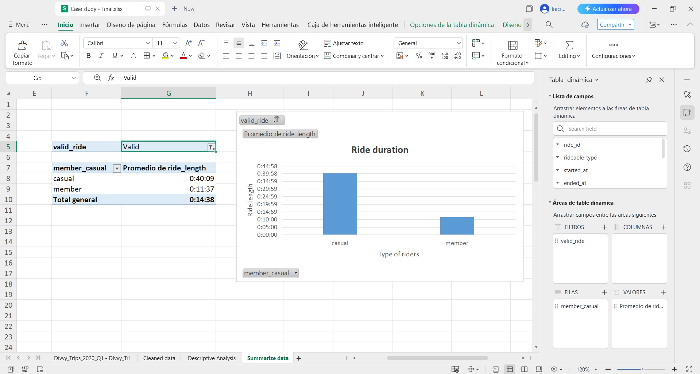
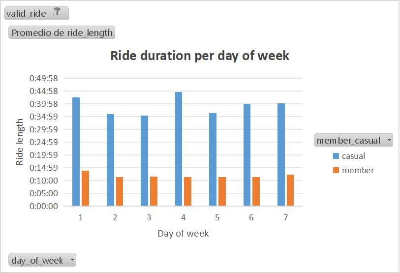

## Bike Sharing Case Study – Excel

*Exploratory analysis and business insights using Microsoft Excel.*

### Introduction

#### * Context of the problem
This case study analyzes bike-sharing usage patterns to identify trends and opportunities for business improvement.

Cyclistic is a bike-share company in Chicago, with 2 pricing plans: "Casual riders" and "Annual members". Customers who purchase single-ride or full-day passes are referred to as casual riders. Customers who purchase annual memberships are Cyclistic members.

The goal of the company is to convert casual riders into annual members due to Cyclistic’s finance analysts have concluded that annual members are much more profitable than casual riders.

#### * Objective of the analysis
The objective of the analysis is to identify trends and patterns in order to understand the needs of the cyclistc riders and design strategies to convert casual riders into annual members.

#### * Key questions
1. How do annual members and casual riders use Cyclistic bikes differently?
2. Why would casual riders buy Cyclistic annual memberships? 
3. How can Cyclistic use digital media to influence casual riders to become members?

### Data set description
* **Data Provider:** Motivate International Inc.  
* **License:** Public open data (as provided in the Google Data Analytics Certificate)  
* **Usage:** Educational and analytical purposes only
* **Number of records:** 426,887 records
* **Main columns:** ride_id, started_at, ended_at, member_casual.
* **Time period:** 2020

The datasets used in this case study were provided as part of the **Google Data Analytics Professional Certificate** for educational purposes.

The data is derived from public bike-sharing trip data made available by **Motivate International Inc.**, under an open data license.  
The company name *Cyclistic* is fictional and was used solely for the purposes of this case study.

Due to data privacy considerations, all personally identifiable information (PII) has been removed from the dataset.  
As a result, individual riders cannot be identified, and certain analyses are outside the scope of this study.

### Data Cleaning & Processing

A "ride_length" column was created, which calculated the duration of every ride by substracting the column started_at from the column ended_at, and formated as [hh]:mm:ss This format allow us to see the time accumulated for rides with more than 24 hours.

By checking the new column created, it was realized that there were a considerable number of rides where the time of the ride reflected durations of days, weeks, and months; small values for the rides like just a couple of seconds, or even negative values when the ended time of the ride was earlier than the started time. Based on that, those rides were considered as "unreal" or "invalid" rides which could affect negatively the process of analysis.

A way to solve this was to delimeter the range of valid rides by setting a minimum and a maximum of ride_length. In order to do this, the hours, minutes and seconds were gotten from the new column ride_length, by using the functions =INT(ride_lenght column * 24) to get the hours, =MINUTE(ride_lenght column) to get the minutes, and =SECOND(ride_lenght column) to get the seconds, and placed in new columns named hours_legth, minutes_length, and seconds_length respectively.

With these 3 new columns, delimeters of time for the rides can be set to get a better analysis. The delimeters for a valid ride were: 
* **Minimum:** ride_lenght >= 1 minute
* **Maximum:** ride_lenght < 24 hours

A new column was created to categorize valid and invalid rides, by using the functions =IF() and =AND():

=IF(
 AND(
   hours_length * 3600 + minutes_length * 60 + seconds_length >= 60,
   hours_length * 3600 + minutes_length * 60 + seconds_length < 86400
 ),
 "Valid",
 "Invalid"
)

A column named day_of_week was created to get the day of the week that each ride started by using the =WEEKDAY() function for further analysis, where the returned value corresponds for 1 = Sunday and 7 = Saturday:

### Data Analysis

#### * Descriptive Analysis

In a new sheet named "Descriptive Analysis" in the same project, a pivot table was created to get a better sense of the data layout. Here, the pivot table was set in the next way:
* **Rows:** member_casual
* **Values:** average of ride_length, maximum of ride_length and minimum of ride_length
* **Filter:** valid_ride

From this first look, we can see that casual riders use more time the bicycles than annual members, which can be a sign that casual riders used of bicycles is for tourism purposes. A deeper analysis is still needed to get more insights of casual and member riders usage of the bicycles.

#### * Summarized Data

A new sheet named "Summarized data" was created in order to create new pivot tables and get deeper insights from the data. 

First, a pivot table was created to focus on the average of the ride_length by members and casual riders, and visualized with a bar chart. For this, the pivot table was set as follows:
* **Rows:** member_casual
* **Values:** average of ride_length
* **Filter:** valid_ride

Then, a second pivot table and a bar chart were created to review the average of the ride_length by members and casual riders per day_of_week. This pivot table was set as follows:
* **Rows:** day_of_week
* **Columns:** member_casual
* **Values:** average of ride_length
* **Filter:** valid_ride

Finally, a third pivot table and a bar chart were created to calculate the number of rides for members and casual riders by day_of_week by counting each ride_id as follows:
* **Rows:** day_of_week
* **Columns:** member_casual
* **Values:** count of ride_id
* **Filter:** valid_ride

### Share of Findings

With the 3 bar charts created, we can easily visualize the information of the different usage of the bicycles for annual members and casual riders.

#### * **Ride duration**

The "Ride duration" chart shows the type of riders on the X axis, and the average of the rides length on the Y axis as shown below:

**Key findings:**
The analysis shows that casual riders have a significantly longer average trip duration than members (approximately 40 minutes versus 15 minutes). This pattern suggests that casual users utilize the service for recreational or tourism purposes, while members primarily use it as a functional means of transportation for short, recurring trips.

This difference in behavior indicates that conversion strategies should focus not only on price but also on communicating benefits associated with frequency of use and daily convenience.

#### * **Ride duration per day of week**
The "Ride duration per day of week" chart shows the day of the week on the X axis with Sunday = 1 and Saturday = 7, and the average of the rides length on the Y axis for both type of riders as shown below:

**Key findings:**
Analysis of average trip duration per day of the week reveals that casual riders have significantly longer trip times than members on all days. While members exhibit a stable and consistent pattern, casual users show slight variations with increases toward the weekend.

This behavior suggests that members use the service as a regular means of transportation, while casual users employ it for recreational purposes, especially on weekends.

Therefore, conversion strategies should focus on incentivizing repeat visits rather than increasing usage duration.

#### * **Number of rides**
The "Number of rides" chart presents the day of the week on the X axis with Sunday = 1 and Saturday = 7, and on the Y axis is presented the count of the unique rides' id that represents the total number of rides for each type of cyclist:

